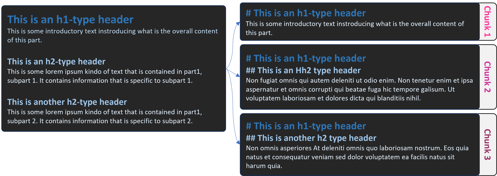

# Chunk Norris

## Goal

This project aims at improving the method of chunking documents from various sources (HTML, PDFs, ...)
An optimized chunking method might lead to smaller chunks, meaning :
- **Better relevancy of chunks** (and thus easier identification of useful chunks through embedding cosine similarity)
- **Less errors** because of chunks exceeding the API limit in terms of number of tokens
- **Less hallucinations** of generation models because of superfluous information in the prompt
- **Reduced cost** as the prompt would have reduced size

## Installation

Using Pypi, just run the following command :
```pip install chunknorris```

## Chunkers

The package features multiple ***chunkers*** that can be used independently depending on the type of document needed.

All chunkers follow a similar logic :
- Extract table of contents (= headers)
- Build chunks using the text content of a part, and put the titles of the parts it belongs to on top



### MarkdownChunkNorris

This chunker is meant to be used **on markdown-formatted text**. 

#### Usage

```py
from chunkers import MarkdownChunkNorris

text = """
# This is a header
This is a text
## This is another header
And another text
## With this final header
And this last text
"""
chunker = MarkdownChunkNorris()
chunks = chunker(text)

# Alternatively, you may use the .chunk_file() method to pass a filepath
chunks = chunker.chunk_file(filepath="myfile.md")
```

### HTMLChunkNorris

This chunker is meant to be used **on html-formatted text**. Behind the scene, it uses markdownify to transform the text to markdown with "setex"-style headers and uses MarkdownChunkNorris to process it.

#### Usage

```py
from chunknorris.chunkers import HTMLChunkNorris

html_string = """
<h1>This is 1st level heading</h1>
<p>This is a test paragraph.</p>
<h2>This is 2nd level heading</h2>
<p>This is a test paragraph.</p>
<h2>This is another level heading</h2>
<p>This is another test paragraph.</p>
"""
chunker = HTMLChunkNorris()
chunks = chunker(html_string)

# Alternatively, you may use the .chunk_file() method to pass a filepath
chunks = chunker.chunk_file(filepath="myfile.html")
```

### Advanced usage of chunkers

Additionally, the chunkers can take a number of argument allowing to modifiy its behavior:

```py
from chunknorris.chunkers import MarkdownChunkNorris

mystring = "# header\nThis is a markdown string"

chunker = MarkdownChunkNorris() # or any other chunker
chunks = chunker(
    mystring,
    max_headers_to_use="h4",
    max_chunk_word_count=250,
    link_placement="in_sentence",
    hard_max_chunk_word_count=400,
    min_chunk_word_count=15,
    )
```

***max_headers_to_use*** 
(str): The maximum (included) level of headers take into account for chunking. For example, if "h3" is set, then "h4" and "h5" titles won't be used. Must be a string of type "hx" with x being the title level. Defaults to "h4".

***max_chunk_word_count***
(int): The maximum size (soft limit, in words) a chunk can be. Chunk bigger that this size will be chunked using lower level headers, until no lower level headers are available. Defaults to 200.

***link_placement***
(str): How the links should be handled. Defaults to leave_as_markdown.
Options :
- "leave_as_markdown" : the links are kept in markdown format
- "remove" : text are kept but links are removed
- "end_of_chunk" : adds a paragraph at the end of the chunk containing all the links
- "in_sentence" : the links are added between parenthesis inside the sentence

***hard_max_chunk_word_count***
(int): The hard maximum of number of words a chunk can be. Chunks bigger by this limit will be split into subchunks. ChunkNorris will try to equilibrate the size of resulting subchunks. It uses newlines to split. It should be greater than max_chunk_word_count. Defaults to 400. 

***min_chunk_word_count***
(int): Minimum number of words to consider keeping the chunks. Chunks with less words will be discarded. Defaults to 15.

### PDFChunkNorris

#TODO:

