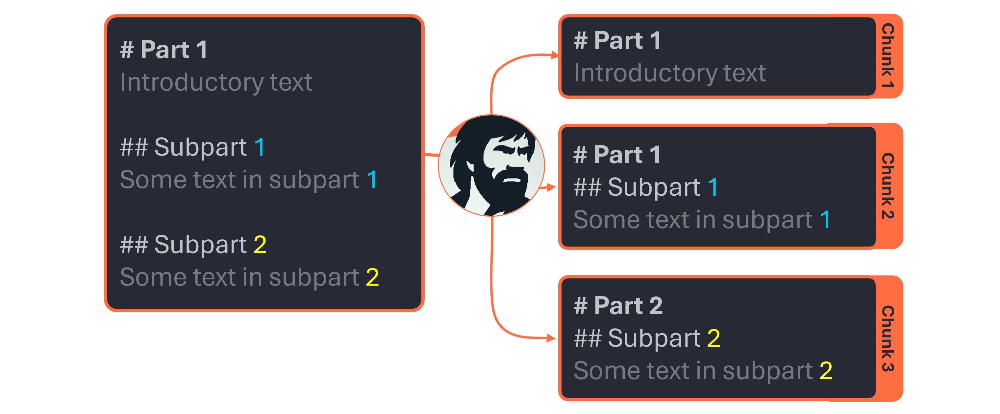

# ChunkNorris

📒 [Documentation](https://wikit-ai.github.io/chunknorris/) | 🧪 [Testing app](https://huggingface.co/spaces/Wikit/chunknorris)


## Goal

This package aims at improving the method of chunking documents from various sources (HTML, PDFs, ...).
In the context of Retrieval Augmented Generation (RAG), an optimized chunking method might lead to smaller chunks, meaning :
- **Better relevancy of chunks** (and thus easier identification of useful chunks through embedding cosine similarity)
- **Less errors** because of chunks exceeding the API limit in terms of number of tokens
- **Less hallucinations** of generation models because of superfluous information in the prompt
- **Reduced cost** as the prompt would have reduced size

## ⬇️ Installation

Using Pypi, just run the following command :
```pip install chunknorris```

## 🚀 Quick usage

You can directly invoke chunknorris on any **.md**, **.html** or **.pdf** file by running the following command in your terminal :

```chunknorris --filepath "path/to/myfile.pdf"```

See ``chunknorris -h`` for available options. Feel free to experiment 🧪 !

## ⚙️ How it works

ChunkNorris relies on 3 components :
- **Parsers** : they handle the cleaning and formating of your input document. You may use any parser suited for your need (e.g PdfParser for parsing PDF documents, MarkdownParser for parser)
- **Chunkers** : they use the output of the parser and handle its chunking.
- **pipelines**: they combine a parser and a chunker, allowing to output chunks directly from you input documents.

### Parsers

The role of parsers is to take a file or a string as input, and output a clean formated string suited for a chunker. As of today, **each file type relies on a dedicated parser**. For example, you may use ``MarkdownParser`` : for parsing markdown files/strings or ``PdfParser`` : for parsing PDF files.

All parsers will output a markdown-formatted string. Indeed, markdown is a great format to be use in RAG application as it is very well understood by LLMs.

### Chunkers



The role of chunkers is to process the output of parsers in order to obtain relevant chunks of the document. As of today, only ``MarkdownChunker`` is available. Used in conjunction with parsers, it allows to process a various inputs.

The chunking strategy of chunkers is based on several principles:
- **Each chunk must carry homogenous information.** To this end, they use the document's headers to chunk the documents. It helps ensuring that a specific piece of information is not splitted across multiple chunks.
- **Each chunk must keep contextual information.** A document's section might loose its meaning if the reader as no knowledge of its context. Consequently, all the headers of the parents sections are added ad the top of the chunk.
- **All chunks must be of similar sizes.** Indeed, when attempting to retrieve relevant chunks regarding a query, embedding models tend to be sensitive to the length of chunks. Actually, it is likely that a chunk with a text content of similar length to the query will have a high similarity score, while a chunk with a longer text content will see its similarity score descrease despite its relevancy. To prevent this, chunkers try to keep chunks of similar sizes whenever possible.


### Pipelines

Pipelines are the glue that **sticks together a parser and a chunker**. They use both to process documents and ensure constant output quality.

## Usage

You may find more detailed examples in the [examples section](./docs/examples) of the repo. Nevertheless, here is a basic example to get you started, assuming you need to chunk Mardown files.

```py
from chunknorris.parsers import MarkdownParser
from chunknorris.chunkers import MarkdownChunker
from chunknorris.pipelines import BasePipeline

# Instanciate components
parser = MarkdownParser()
chunker = MarkdownChunker()
pipeline = BasePipeline(parser, chunker)

# Get some chunks !
chunks = pipeline.chunk_file(filepath="myfile.md")

# Print or save :
for chunk in chunks:
    print(chunk.get_text())
pipeline.save_chunks(chunks)
```

The ``BasePipeline`` is rather simple : it simply puts the parsers output into the chunker. While this is enough most in most cases, you may sometime need to use more advanced strategies.

Feel free to experiment with various combinations, or even to implement your the pipeline that suits your needs !.


### Advanced usage

Additionally, the chunkers and parsers can take a number of argument allowing to modifiy their behavior. For example:

```py
import tiktoken
from chunknorris.chunkers import MarkdownChunker

chunker = MarkdownChunker(
    max_headers_to_use="h4",
    max_chunk_word_count=250,
    hard_max_chunk_word_count=400,
    min_chunk_word_count=15,
    hard_max_chunk_token_count=8000,
    tokenizer=tiktoken.encoding_for_model("text-embedding-3-large"),
)
```

***max_headers_to_use*** 
(str): The maximum (included) level of headers take into account for chunking. For example, if "h3" is set, then "h4" and "h5" titles won't be used. Must be a string of type "hx" with x being the title level. Defaults to "h4".

***max_chunk_word_count***
(int): The maximum size (soft limit, in words) a chunk can be. Chunk bigger that this size will be chunked using lower level headers, until no lower level headers are available. Defaults to 200.

***hard_max_chunk_word_count***
(int): The hard maximum of number of words a chunk can be. Chunks bigger by this limit will be split into subchunks. ChunkNorris will try to equilibrate the size of resulting subchunks. It uses newlines to split. It should be greater than max_chunk_word_count. Defaults to 400. 

***min_chunk_word_count***
(int): Minimum number of words to consider keeping the chunks. Chunks with less words will be discarded. Defaults to 15.

***hard_max_chunk_token_count***
(int | None): The hard maximum of tokens a chunk can be. This is used after the word-based chunking. Every chunk bigger (in token) than this number will be split into subchunks. ChunkNorris will try to equilibrate the size of resulting subchunks, still considering newlines to avoid random cuts. If None, this parameter won't be used. If an int value is provided, then a tokenizer must be provided as well. Defaults to None.

***tokenizer***
(Any | None): The tokenizer to use to count tokens. Can be any instance of a class that has an ```.encode()``` method, that takes a string as input and returns a list of tokens. Must be provided if ```hard_max_chunk_token_count``` is set. Defaults to None.
