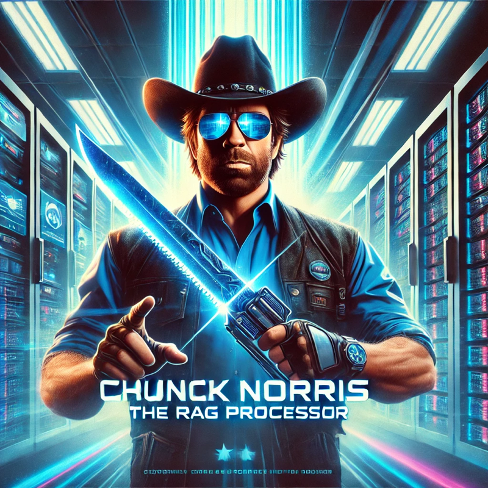

# Chunk Norris

## Goal

This project aims at improving the method of chunking documents from various sources (HTML, PDFs, ...).

In the context of Retrieval Augmented Generation (RAG), an optimized chunking method might lead to smaller chunks, meaning :
- **Better relevancy of chunks** (and thus easier identification of useful chunks through embedding cosine similarity)
- **Less errors** because of chunks exceeding the API limit in terms of number of tokens
- **Less hallucinations** of generation models because of superfluous information in the prompt
- **Reduced cost** as the prompt would have reduced size