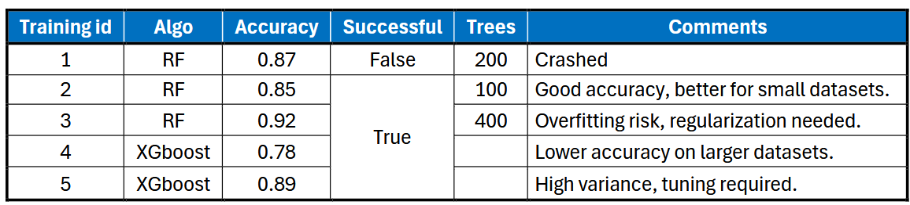
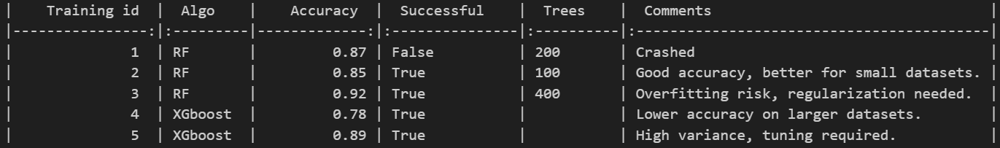
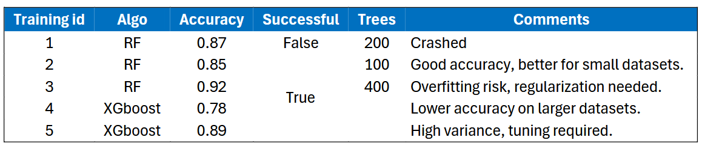
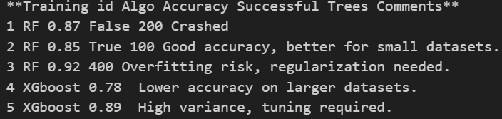

# Current limitations

This sections covers some examples about ``chunknorris``'s know **current** limitations.

???+ note

    If you've ever worked with parsing documents, you'll know that producing clean results can be quite challenging, particularly with .pdf files. The diverse range of document layouts makes it difficult to create a universal solution that works seamlessly for all documents. 
    
    As a result, **even though ``chunknorris`` has been developed to consistently deliver reliable results across various documents, there may still be instances where it does not perform as expected**.

### [PDF] Table detection for borderless tables

``chunknorris`` uses the vectors (= lines) present in ``.pdf`` to parse the table's structure and infer the table's cells. While this works great, it also means that tables that only have a suggested structure (no lines) won't be parsed properly as tables.

???+ success "Example of tables correctly parsed"

    | Input | Output |
    |-------|--------|
    |  |  |

???+ failure "Example of tables incorrectly parsed"

    | Input | Output |
    |-------|--------|
    |  |  |

!!! tip inline end

    **The fact that a given table is not parsed properly does not mean that the LLM will not be able to answer** ! LLM have seen plently of data like this and may be able to "guess" the data structure.

If your documents are **packed with borderless tables** and their parsing is **crucial to you**, I recommend managing table parsing separately with one of the many available tools or AI models specifically designed for this purpose. As most of the best performing tools rely on deep learning, **choice has been made to avoid breaking speed performance by integrating such tools in ``chunknorris``**. Nevertheless, some work is planned to achieve conparable results with minimal computational requirements.

### [PDF] Wrong reading order for .pdf coming from Powerpoint

Because of the manner text blocks are encoded in the .pdf file when exported from powerpoint, the resulting text order **may not reflect the intuitive reading order**. This issue is **not** specific to ``chunknorris``: **almost every library that offer to extract the text from a pdf file will have this same issue** !

