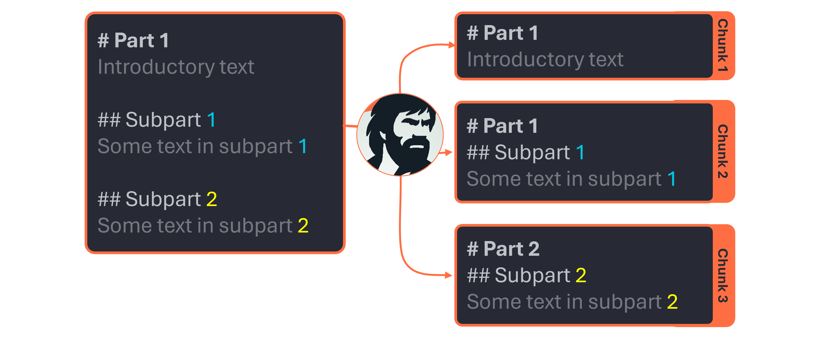

# ⚙️ How it works

In a nutshell, ``chunknorris`` relies on 3 components :

- **Parsers** : they handle the cleaning and formatting of the input document.
- **Chunkers** : they use the output of the parser and handle its chunking.
- **Pipelines**: they combine a parser and a chunker, allowing to output chunks directly from you input documents.

### Parsers

The role of parsers is to take a file or a string as input, and output a clean markdown-formatted content suited for a chunker. Each parser is dedicated to a type of document. 

**Various parsers are available**, for example :

- ``MarkdownParser`` : for parsing markdown files/strings.

- ``HTMLParser`` : for parsing html-formatted files/strings.

- ``PdfParser`` : for parsing PDF files.

All parsers will output a markdown-formatted ``MarkdownDoc`` object, whose puprose is to be fed to a chunker.

### Chunkers

The role of chunkers is to process the output of parsers in order to obtain relevant chunks from the document. As all parsers output markdown-formatted ``MarkdownDoc`` objects, all their outputs can be chunked by the ``MarkdownChunker``.

??? note

    Markdown formatting has proven to be very well understood by LLMs, while being human-readable (unlike HTML for example). Consequently, it has been chosen as a common interface for all parsers' outputs. That is why only the ``MarkdownChunker`` has been developed so far. More chunkers could be developed in the future if there is the need to chunk other types of parser's output.

The chunking strategy of chunkers is based on several principles :

- **Each chunk must carry homogenous information.** To this end, chunkers use the document's headers to chunk the documents. It helps ensuring that a specific piece of information is not splitted across multiple chunks.

- **Each chunk must keep contextual information.** A document's section might loose its meaning if the reader as no knowledge of its context. Consequently, all the headers of the parents sections are added ad the top of the chunk.

- **All chunks must be of similar sizes.** Indeed, when attempting to retrieve relevant chunks regarding a query, embedding models tend to be sensitive to the length of chunks. Actually, it is likely that a chunk with a text content of similar length to the query will have a high similarity score, while a chunk with a longer text content will see its similarity score descrease despite its relevancy. To prevent this, chunkers try to keep chunks of similar sizes whenever possible.

All chunkers output a list of ``Chunk`` objects containing the chunk's text and information relative to it.

### Pipelines

Pipelines are the glue that sticks together a parser and a chunker. They use both to process documents and ensure **constant output quality**.

